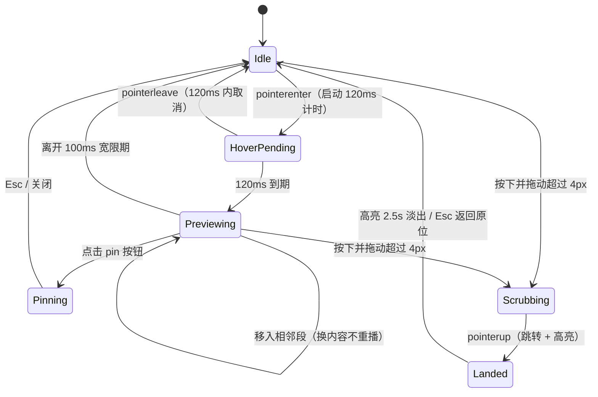

# dsh-turnbar · 前期规划设计
**（dsh 对话轮次导航插件 · 定名 dsh-turnbar：用户 2026-08-16 终审；起因 dsh-rewind 在 npm 已被"回滚"语义插件占用 · v0.1 规划稿 · D1 已完成：FINDINGS.md / SPIKE.md）**

> **标注约定（全文适用）**
> - 【事实】＝委托方已核实 / 本文检索已证实的生态事实；
> - 【假设】＝本文做出的、待验证的判断；
> - 【需查证】＝需读 dsh 源码或官方文档确认的内部细节。本文**不编造**任何具体 API、事件名、配置项；所有 dsh 内部机制引用均标注确定性程度。

---

## TL;DR（一页速览）

- **赛道判定（修正）**：不是空白。`vlln/dsh-navbar` 已实现"右缘节点条 + 悬停预览 + 点击跳转"的最小闭环（2026-08-13/14 更新，2~14 star、0 月下载）。但它是**滑动窗口点链**（>11 个节点只显示局部窗口，无全局概览）、只导航用户消息、无元信息（工具/文件/token）、无章节/搜索/书签/键盘，纯 DOM anchor 实现决定了它做不了数据层功能。**类别心智尚未被任何人确立。**
- **定位**：做"视频播放器"，不做"点链"——底部全景进度条 + 拖动 scrub + 富元信息预览卡 + 章节与搜索。一句话：**dsh-navbar 给你点，dsh-rewind 给你整个播放器。**
- **命名（已终审 2026-08-16）**：**`dsh-turnbar`**（npm 实查可用；用户选定）。起因：dsh-rewind 在 npm 已被"回滚对话"插件占用且语义撞车（l-dot v0.2.2）。备选 scrub/timeline/playback 均已实查可用。D7 前用用户 npm 账号占名。
- **MVP 四件套**：轮次捕获（事件流 + 存储回填双通道）→ 全景进度条 + playhead → 悬停预览卡（120ms 出卡、≤200ms 渲染）→ 点击/拖动跳转（≤300ms 到位 + 高亮 + Esc 返回）。
- **技术主线**：node 半区采数据（TurnStore + JSONL sidecar）+ web 半区注入 UI（Web Component，框架无关）；对 dsh 依赖收敛到 4 个 adapter 文件，能力探测 + 5 级降级。
- **节奏（决策 #16：越快越好）**：7 天冲刺——D1 占名 + 竞品扫描 + dsh 源码 spike，D7 范围冻结 + npm v0.1.0 + 目录站提交；发布前在 200+ 轮真实会话上走完核心闭环，README 截图顺手拍（决策 #18）。
- **决策状态**：11.2 全部 18 项已于 2026-08-16 确认。其中 15 项按推荐执行；#16/#17/#18 为提速取舍：冲刺由 10 天压缩至 7 天、竞品作者接洽降为可选动作、以标注截图替代 demo 视频且不建独立会话生成器。
- **最大风险**：官方内置（R1）与 dsh-navbar 快速演进补齐数据层（R2b），触发条件与转向方案见第 11 章。

---

## 第 1 章 · 机会验证与生态调研

### 1.1 相邻插件盘点

| 插件 | 定位（确定性） | 与本插件的关系 | 不足 / 风险 |
|---|---|---|---|
| **vlln/dsh-navbar**【事实：**D1 已 clone 通读源码（vendor/dsh-navbar），用户本机已安装使用中**】 | v0.3.0：右缘垂直节点条 + 悬停 6 行预览卡 + 点击跳转高亮 + 滚轮逐条切换 + **pin 精选（金色椭圆盘，localStorage 持久化，官方 `conversation.chat.assistant-actions` 插槽注入按钮）**；>11 节点滑动窗口；纯 DOM anchor（`data-time-hover-root`），无数据通道 | **直接竞品，迭代极快（3 天从 v0.1 到 v0.3+pin）** | ①滑动窗口＝无全局概览；②仅用户消息、无元信息；③无搜索/章节/键盘；④无数据层；⑤但**它已把 V1 的"书签"做掉了**，且作者 vlln 是生态多产者（task-status、plugin-registry、focus-chat） |
| **YesSanSan/dsh-conversation-outline**【事实：D1 已读 README + PLUGIN_DEV_NOTES】 | **最强相邻竞品**：better-sidebar 侧边栏「对话大纲」tab，按轮次结构化（工具调用合并折叠、检查点、错误行）、**LLM 一句话标题（`llm.stream` + 指纹缓存）**、一键跳转（聊天页 `data-chat-anchor-key` + 轨迹页映射）、**`ctx.sessionQuery.readSession/listEvents` 读会话日志**、`ctx.webServer.register` 暴露同源 JSON 路由、设置面板 | **数据层已被占**：轮次结构化 + 跳转 + LLM 标题已实现 | ①**形态是侧边列表，非常驻控件**——无全景条、无 scrub、无悬停预览；②无关键词搜索；③无 token/上下文余量；④依赖 better-sidebar v0.12.0+（**第三方宿主依赖**，安装链长）；⑤轮次标题 = 我们的"章节"方向被部分占位 |
| **invalidnaaaame/dsh-scroll-timeline**【事实：D1 已读 README】 | dsh-navbar 的 MIT 衍生：侧边右缘横条节点轨（每用户消息一条）、磁吸山峰 hover、悬停预览、点击跳转、**全历史常显**（容器内滚动） | 同形态变体 | 证明了"全历史可见"是共同演化方向；仍无数据层/元信息/搜索 |
| **Yujm888/dsh-turn-rail**【事实：存在，npm 可装】 | 轮次轨道 | 同形态变体 | D2 后续查源码 |
| **dsh-turn-index**【事实：官方仓库 discussions#493 在议，npm v0.1.1】 | 轮次索引侧边栏，"长会话下也可靠" | 同形态变体 | 官方讨论区曝光 = 品类需求被官方社区看见 |
| **vibeinging/dsh-turn-navigator**【事实：目录页实测】 | 轮次导航（细节未披露） | 名义竞品 | 目录站实测**安装即坏**（GitHub 源装不上，需 pnpm allowBuilds 手工放行）；文档极薄；1 star。当前无威胁，但**占走了 turn-navigator 这个名字** |
| **dsh-web-ui**【事实：委托方核实】 | Web UI 插件与皮肤合集（task board、git graph 等） | 最潜在的"吸收者" | 广度优先合集，单点交互深度通常不足；【需查证】其源码/roadmap 是否规划轮次导航 |
| **dsh-session-export**【事实：委托方核实，patch 层完整开发案例】 | 会话导出与离线复盘 | **互补非竞品**，最佳参照工程 | 离线导出 ≠ 在线导航；它证明会话数据可被插件读到、patch 层工程范式可行；V2 的"带锚点导出"应与其互通而非重复 |
| **ModLens / ModSearch**【事实：存在；功能细节未核实→需查证】 | 按命名推断为模型/插件观测与检索 | 大概率非同类 | Day-1 扫描确认 |
| **dsh-TUI**【事实】 | 终端 UI | 形态不同 | 非竞品；V2+ 移植候选 |
| **Agent Teams / Automation / 长期记忆类**【事实】 | 编排与记忆 | 不同问题域 | — |
| **dsh 内置轨迹回放**【事实：存在】 | 运行级复盘 | 需求部分重叠 | 【假设】回放面向离线事后复盘，非在线会话内即时跳转；【需查证】其是否支持 live 会话内跳转与悬停预览，若已支持则本插件价值坍缩一半 → 触发第 11 章 R1 转向条件 |
| **长尾同类**（插件商店已索引 1080+）【事实：社区 DSH Plugin Store 索引数】 | 未知 | Day-1 必查 | 多个目录站（dshplugins.cc / dshplugin.dev / dshbase.com / dsh-plugins.org 约 475 条 / dshplugin.app / dshget.com）+ 三个 awesome 列表全量过一遍 |

### 1.2 空白判定（修正委托方预设）

**结论（D1 修订）：形态层（点链/轨道/侧栏大纲）五天内已被 5 个插件填充——navbar、scroll-timeline、turn-rail、turn-index、conversation-outline；conversation-outline 甚至已占掉"数据层读日志 + 轮次结构化 + LLM 标题"。但"**常驻全景进度条 + 拖动 scrub + 悬停富元信息预览 + 会话内关键词搜索**"这一具体组合仍无人做。差异化空间收窄但成立；窗口期判断从"2~6 周"修正为"**以天计**"——D7 发布的决策因此更加正确。**

由此带来的策略修正（D1 增补）：
1. **与 conversation-outline 的区隔是新的生死线**：它是"停下来查的地图"（侧栏列表、要点开 tab），我们是"不离手的方向盘"（常驻条、悬停即得、拖动即达）。README 对照表必须把它列进去。
2. **搜索（⌘K）从 V1 提前为 v0.1.x 差异化主打**——五个竞品无一有会话内关键词搜索，且 `user/message` 的 `data.content` 全文在手，实现成本低。
3. **悬浮卡富元信息（工具数/文件/token）是悬停体验的护城河**：DOM anchor 系竞品拿不到 `tool/call`、`usage`、`contextWindow`，我们天然有。

由此带来的策略修正：
1. **从"抢占空白"改为"高执行力快速跟进 + 明显差异化"**。dsh-navbar 的纯 DOM anchor 架构（无 node 半区）是其天花板：搜索、章节、token、旧会话回填全部做不了，这些恰好是我们的数据层（事件流 + 存储读取）天然覆盖的。
2. **命名必须避开** `navbar` / `turn-navigator` / `turnnav` 一族（第 2 章）。
3. **README 首屏放一张与 dsh-navbar 的能力对照表**（尊重、链接对方），让 30 秒访客看懂"为什么不用现有的"。
4. **给 dsh-navbar 提 PR 不是好路径**：其架构无法承载我们的路线图（数据层功能需要重写）；正确定位是独立插件 + 互通 + 公开对照（决策清单 #1）。

**窗口期估计**【假设】：dsh 开源 3 天即出现最小竞品，按 1080+ 插件的填充速度，一个被验证的品类在 2~6 周内会出现第二、第三个进阶实现。先发者未跑出来（0 下载），**品类第一名仍在场上**——这决定了第 9 章的 7 天硬冲刺与 D7 范围冻结。

**对委托方【假设】的核验**：zcode / Google AI Studio 的"快速切换历史对话"确为**会话间**（cross-session）切换器；本插件定位**会话内**（in-session）轮次定位，判断成立。且截至本人知识，主流 agent 界面（ChatGPT、Cursor 等）均无"轮次进度条 + 悬停预览"形态——把视频进度条范式迁移到 AI 会话是真空白，dsh-navbar 只做了这个范式的 20%（点链，无播放器）。

### 1.3 Day-1 竞品扫描清单（可执行）

- GitHub：topic `dsh-plugin` + 搜索 `dsh turn / navigation / jump / history / progress / scrub`，按 star 排序前 50；
- 六个目录站 + 三个 awesome 列表（0xsline / bruc3van / beancookie）全条目过一遍，标注"导航/搜索/复盘"相邻项；
- **clone 并通读 vlln/dsh-navbar 源码**（它是 web-profile 插件的可用范例：安装命令形态、anchor 定位方式、注入手法、目录结构都能直接参考）；
- dsh 官方仓库 Discussions / Roadmap 搜 navigation；
- 产出 `FINDINGS.md`（结论 + 证据链接），作为 v0.1 的 go/no-go 依据。

---

## 第 2 章 · 产品定位与命名

### 2.1 命名

先说约束：`dsh-navbar`、`dsh-turn-navigator` 已存在且同赛道，任何 `nav / turn / navigator` 族命名都会造成检索混淆和"抄袭感"。

| 候选 | 语义与气质 | 判定 |
|---|---|---|
| **dsh-turnbar** | 轮次条——形态即名字；turn 族检索可发现（turn-rail/turn-index 邻近但可区分）；npm 实查 404 可用 | ✅ **用户终审（2026-08-16）** |
| dsh-scrub / dsh-timeline / dsh-playback | scrub 交互即名字 / 直白但与 dsh-scroll-timeline 易混 / 播放器隐喻 | 备选（均已实查 404 可用） |
| dsh-scrub | 拖动 scrub 是核心交互；但 scrub 一词歧义（擦洗） | 备选 |
| dsh-progressbar | 字面直观；与"任务进度条"类插件语义冲突，长且平 | 弃 |
| ~~dsh-turnnav~~ | 与 dsh-navbar / dsh-turn-navigator 撞名 | **必弃** |

D1 已实查（FINDINGS.md §3）：dsh-rewind 200 已占（回滚语义插件）、dsh-scrub/dsh-timeline/dsh-turnbar/dsh-playback 均 404 可用。**npm publish 需用户账号，D7 前完成占名**（吸取 dsh-navbar "MIT vs BSD-3 声明不一致"的教训，license 从第一天写清楚）。

- **slogan（EN）**："A progress bar for your agent conversations."
- **slogan（zh）**："给 agent 会话装上视频进度条：悬停预览、拖动直达。"
- **对内定位句**：dsh-navbar 给你一串点，dsh-rewind 给你整个播放器。

### 2.2 目标用户画像

| 画像 | 权重 | 场景与诉求 | 我们的主张 |
|---|---|---|---|
| P1 长会话重度用户 | **70%（MVP 只打它）** | 100+ 轮日常；痛点＝滚动条猜位置、找回"之前提过的要求" | "像拖视频一样拖回第 47 轮" |
| P2 复盘 agent 行为的开发者 | 20% | 关心哪轮调了什么工具、改了哪个文件、token 花在哪 | 预览卡元信息 + 章节；V2 token/回放联动的买单者，也是高质量 issue 来源 |
| P3 演示/汇报者 | 10% | 录屏、直播时快速跳到关键轮 | 书签 + 键盘导航（V1）；也是传播者——GIF 好看就会转发 |

### 2.3 README 首屏完整文案草案

```markdown
# dsh-turnbar

> A progress bar for your agent conversations.

Long agent sessions are productive — until you need to find *that one
requirement you mentioned 80 turns ago*. Scrollbars make you guess and
re-scroll. dsh-turnbar gives your DeepSeek Harness chat a video-style
progress bar: hover to preview any turn, drag to scrub, click to jump,
`Esc` to come back.

 <!-- 2~3 张标注截图：① 全景条 + 悬停预览卡；② 跳转高亮 + Esc 返回 toast；③ 500 轮聚合态。可选升级：⌘⇧5 随手录 15s scrub 屏录转 GIF（10 分钟成本、转化杠杆最大，但非必需） -->

**Install** (dsh ≥ 0.x):

    dsh plugin --profile web add github:<you>/dsh-turnbar#main
    <!--【需查证】以 dsh 官方插件安装文档为准；竞品目录显示该命令形态，D2 前复核 -->

That's it. Open any session — the bar appears above the input box.
Zero config. Old sessions are backfilled automatically.

- 🎚 **Full-map progress bar** — every turn is a segment; the playhead
  tracks where you are. See the whole conversation at a glance.
- 🖼 **Hover preview cards** — role, first lines, tool calls, file edits
  and time, before you jump. Pin a card to read more.
- ⤴ **Jump & return** — click to land in ≤300 ms with a highlight;
  press `Esc` to return, like GitHub's jump-to-line.
- 🧩 **Graceful degradation** — if your dsh version changes APIs,
  dsh-turnbar disables itself with a notice instead of breaking.

**Why not dsh-navbar?** It's a great lightweight dot-chain — but it
shows a sliding window (no full map), user messages only, and no
search or chapters. [Comparison table](#comparison) · 简体中文
```

zh-CN 版同构，标题不变，正文全译；`<comparison>` 表：全景条 vs 滑动窗口 / 用户+助手+子代理 vs 仅用户 / 元信息 / 搜索 / 章节 / 书签 / 键盘 / 旧会话回填 / 降级策略，逐行 ✅/❌，最后一行链接对方仓库并致意。

---

## 第 3 章 · 用户故事与场景（7 条，含验收口径）

| # | 故事 | 验收口径（可测） |
|---|---|---|
| US-01 | **找回约束**：P1 在 200 轮会话中找回"之前提过的'必须用 TypeScript'那条要求" | 拖动/悬停扫描并定位目标轮 ≤60s；点击后 ≤300ms 目标轮可见并高亮 |
| US-02 | **复盘改动**：P2 想知道 agent 在哪一轮改了哪个文件 | 预览卡 meta 显示 `📄 N`（V1 起含文件名 tooltip）；跳转后该轮工具调用完整可见 |
| US-03 | **演示跳转**：P3 录屏时需在 3 个关键轮之间跳 | V1 书签后 ≤2 次点击到达；MVP 期可用点击条 + Esc 返回替代 |
| US-04 | **上下文余量**：P1/P2 想知道上下文窗口是否快满 | V2：卡片显示该轮累计 token，≥80% 上下文窗口时条尾警示色；数据不可得时整字段隐藏（不估算、不误导） |
| US-05 | **跨天恢复**：P1 第二天早上重开昨天的会话，快速回到状态 | 打开 500 轮旧会话回填 ≤1s；playhead 停在上次阅读位置（sidecar 记 `lastReadTurnIndex`） |
| US-06 | **引用旧内容**：P1 想引用某轮自己写过的输入全文 | V1：pin 卡片"复制该轮用户输入"按钮；MVP 期跳转后手动复制 |
| US-07 | **全程不迷路**（环境取向，差异化于滑动窗口）：任何时刻知道自己在大图的哪里 | 条 + playhead 常驻显示"第 x / N 轮"；页面滚动时 playhead ≤100ms 跟随 |

---

## 第 4 章 · 功能设计（三层）

### 4.0 概念定义（全插件数据模型的根）

**轮次（Turn）＝ 用户一次提交输入起，至下一次提交前的全部活动**：user message + 助手完整回复（含工具调用链、子代理活动）。轮次边界＝用户提交事件。子代理活动在 MVP 折叠进父轮并以图标标注；V1 起可作为章节切分信号。

### 4.1 MVP 核心（4 项，边界含"不含"）

| 功能 | 范围 | 不含 |
|---|---|---|
| 1. 轮次数据捕获 | 事件流实时增量 + 存储回填双通道汇入 TurnStore；首句/元信息在采集时一次提取落盘 | 章节推断；token 展示（事件不含 usage 则隐藏字段） |
| 2. 全景进度条控件 | 底部、输入框上方、与聊天列同宽；轮次索引等分映射 + 角色浅色块 + playhead；**不做滑动窗口，永远全图**（对 dsh-navbar 的核心差异） | 章节刻度、书签点（V1） |
| 3. 悬停预览卡 | 120ms 出卡、≤200ms 渲染；单例浮层；pin 态；与拖动 scrub 共用同一卡片 | 组内二级展开；模型摘要 |
| 4. 点击/拖动跳转 | 点击＝smooth ≤300ms（长距离 auto+flash）；拖动 scrub＝实时预览、松手跳；目标高亮 + Esc 返回原位 | URL 锚点同步 |

### 4.2 V1 增强（4 项）

1. **章节自动分段**：信号源优先级＝子代理/任务边界事件【需查证事件是否携带】＞手动书签升级为章节；条上最小 24px 刻度。
2. **关键词搜索跳转**（⌘K）：索引＝用户输入全文 + 助手首段；结果列表（轮号 + 命中句高亮）点击跳转。这是 dsh-navbar 架构上做不了的第一个杀手功能。
3. **书签/手动打点**：卡片或 ⌘B；条上圆点。
4. **键盘导航**：⌘↑/⌘↓ 逐轮跳（滚动联动，不抢输入框焦点）。

### 4.3 V2 愿景（候选池：用户价值 × 实现成本矩阵）

| 候选 | 价值(1-5) | 成本(1-5) | 依赖 | 判定 |
|---|---|---|---|---|
| 每轮 token 与上下文余量预警 | 4 | 3 | 事件携带 usage【需查证】 | **V2 首选**："上下文快满"是真实焦虑，数据现成则成本低 |
| 侧边 minimap（VS Code 式像素级） | 4 | 4 | 滚动像素深度联动 | 观望：全景条已覆盖 80% 价值，形态冗余；issue 强需求再做 |
| 与轨迹回放联动（跳轮 + 触发该轮回放） | 3 | 3 | 回放对外 API【需查证】 | V2 次选：官方 API 稳定后接入，是差异化纵深 |
| 带锚点 Markdown 导出 | 3 | 2 | TurnStore 现成 | V2 保留（便宜）：与 dsh-session-export 格式互通而非重复 |
| `rewind_search` 工具（ctx.tools.register，让模型自己查历史轮次） | 3 | 2 | **唯一已确证的 API**【事实】 | V2 观察：轻量"会话内记忆"，差异化彩蛋；MVP 绝不做 |
| 跨会话时间线浏览器 | 3 | 5 | 多会话索引 + 新 UI 面 | **砍**：是另一个产品（dsh-session-export 领地），迷惑定位 |
| 模型摘要预览 | 2 | 4 | 模型调用，延迟/费用/缓存失效 | **砍**：与"悬停即时"灵魂冲突；仅书签轮后台摘要，社区强需求才启 |

---

## 第 5 章 · 悬停预览与导航控件交互详案（灵魂章节）

### 5.1 预览卡信息架构

```
┌────────────────────────────────────┐  宽 320px（移动端 min(320px, 视口-16px)）
│ #42 · 你 · 2 小时前 ·  🔖 📌       │  header：轮序号(等宽) / 角色徽标 / 时间 / 书签 / pin
│ 用 React 重构登录页，必须用        │  用户输入首句：2 行 line-clamp，14px/1.5
│ TypeScript，不要引第三方库…        │
│ ────────────────────────────────── │
│ 🤖 完成组件拆分，修改 3 个文件，   │  助手首段文本：跳过全部工具输出，12px，85% 不透明度
│ 测试全部通过                       │
│ 🔧 12 · 📄 3 · ~4.2k tok · 上午-章节│  meta 行：工具数 / 文件数 / token / 章节名(V1)
└────────────────────────────────────┘  最高 180px（pin 态 260px）
```

| 区块 | 规则 |
|---|---|
| header 时间 | <24h 显示相对时间（"2 小时前"）；否则 `MM-DD HH:mm` |
| 用户首句提取 | 剥离 markdown：代码块→`‹code 12 行›`、链接→仅显示文字、图片→`‹image›`；折叠空白；截 160 字符；2 行 clamp 加 "…" |
| 助手首段 | 仅取第一个非空文本块，200 字符，2 行 clamp；**工具输出永不进卡片**（几千行输出用计数替代） |
| meta 行 | 工具调用数、文件改动数（V1 起文件名 tooltip）、token（仅当事件携带 usage，否则**整字段隐藏**）、章节名（V1） |
| pin 态增强 | 6 行正文 + 卡内滚动 + 工具调用 top5 列表 + "复制该轮用户输入"按钮（V1） |

### 5.2 交互参数总表（数值级）

| 参数 | 值 | 理由 |
|---|---|---|
| 悬停触发延迟 | **120ms**（配置项 `hoverDelay`，默认 120，允许 0–500） | 抑制扫过误触；YouTube 同类为 100–200ms |
| 隐藏宽限 | **100ms**；指针移入卡片即取消隐藏 | 允许"点到卡上读全文 / 按 pin" |
| 出场动画 | opacity 0→1 + translateY(4px→0)，**150ms** cubic-bezier(.2,0,0,1)；隐藏 100ms | 低于人体感知粘滞阈值 |
| 段间移动 | 只换内容**不重播**出入场动画 | 消除频闪 |
| 卡片定位 | 悬浮段正上方居中、距条 8px；视口顶部可用高度 <220px 翻转到下方；水平 clamp 视口内 8px 边距；**portal 挂到 body** 避免被聊天容器 overflow 裁剪 | 防遮挡、防裁剪 |
| z-index | 初始 1000（聊天层之上、系统弹窗之下）【需查证 dsh web ui 层级约定后校准】 | |
| 拖动 scrub 判定 | pointerdown 后移动 **>4px** 进入 scrub，否则视为 click | 区分点击/拖动 |
| scrub 中 | 卡片 0 额外延迟跟随最近轮次；pointerup 跳转（长距离用 auto 非平滑，守住 ≤300ms） | 视频拖动体感 |
| 点击跳转 | 距离 ≤3000px：`scrollIntoView({behavior:'smooth'})`；否则 `auto` + 落点 flash | 平滑与速度兼得 |
| 目标高亮 | 左缘 2px 主题色 accent + 背景 tint；200ms 淡入；**2.5s 后淡出**或任意输入立即取消 | |
| 跳回（借 GitHub 跳转线） | 跳转成功后 toast「已定位 #42 · `Esc` 返回原位」，5s 自动消失；Esc/点击 toast 回跳 | 试错零成本 |
| playhead | 2px 宽，transform 位移，transition **80ms linear**；由 IntersectionObserver（聊天视口中心所在轮）驱动，rAF 合并回调 | 60fps |
| 键盘（V1） | ⌘↑/⌘↓ 逐轮、⌘K 搜索、⌘B 书签、Esc 关闭/返回 | |

### 5.3 超长轮次的摘要策略（截断 vs 模型摘要的取舍）

**结论：纯截断 + 元信息替代，任何悬停路径都不引入模型调用。** 理由：模型摘要带来 ≥1s 延迟、费用、缓存失效与不可控质量，与"悬停即时"灵魂冲突；几千行工具输出用 `🔧12 · 📄3` 计数表达，信息密度反而高于摘要；超长用户输入（>2000 字）也只截 160 字——找全文靠 V1 关键词搜索兜底，不靠卡片承载。V2 仅对"书签轮"提供一次性后台摘要（非悬停路径）。

### 5.4 导航控件形态

- **位置**：底部、输入框正上方、与聊天列同宽（对齐聊天列左右留白）；视觉轨道 6px，点击热区 28px（Fitts 定律）。
- **映射模型**：**轮次索引等分**（每轮等宽），非像素比例。理由：用户心智是"第几轮"不是"百分之几像素"；等分对 500 轮依旧可预测。像素比例行为由 dsh 原生滚动条继续承担，职责分离。
- **与原生滚动条的关系**：不替代、不隐藏、不劫持；双向联动——滚到哪 playhead 到哪（US-07）。

### 5.5 超长会话聚合（500~1000+ 轮）

- **阈值 150 轮**：以下每轮一个吸附单元；以上分组 `groupSize = ceil(n/40)`，目标 ≤40 段（800 轮会话条上可交互节点 ≤50，DOM 无压力）。
- **组级卡片**：显示 `#180–#189` + 组内前 3 条用户句摘要 + 「⌘K 精确搜索」（V1 前：点击组＝跳到组首）。
- V1 章节上线后，聚合优先按章节边界分组，groupSize 退化为上限保护。
- **永不滑动窗口**——这是与 dsh-navbar 的形态级差异：概览（gestalt）本身就是价值。

### 5.6 交互状态机



### 5.7 参照范式借鉴表

| 范式 | 借鉴 | 舍弃 |
|---|---|---|
| YouTube / B 站进度条 | 悬停缩略图→文本预览卡；章节刻度；离散吸附（对齐轮次边界）；拖动 scrub | 连续时间映射（我们没有连续媒体）；位图缩略图（文本卡生成成本≈0 且信息密度更高） |
| VS Code minimap | 常驻全景概览 + 当前视口指示（playhead）——**反衬 dsh-navbar 滑动窗口的失误** | 像素级渲染（成本高）；大面积常驻占屏 |
| GitHub PR 跳转线 | 键盘跳转；跳转后"返回原位"；锚点心智 | URL hash 同步（V2 再议，取决于 dsh web ui 路由参数【需查证】） |
| 浏览器地址栏历史预览 | 延迟出卡；卡片可移入不消失、可 pin | 列表式多条目（我们一次一轮） |

---

## 第 6 章 · 技术方案

### 6.1 轮次数据从哪来：三条路径对比

| 路径 | 原理 | dsh 依赖深度 | 实时性 | 旧会话回填 | 脆弱度 | 判定 |
|---|---|---|---|---|---|---|
| **A. 订阅 Cordis 会话事件流** | apply(ctx) 内订阅会话/循环插件发布的事件【事实：存在事件流；**具体事件名需查证源码**，dsh-session-export 依赖同类数据通路可作参照】 | 中（事件契约） | ✅ 增量实时 | ❌（仅插件加载后） | 中（改名即失效，可探测） | **主通道** |
| **B. 读取会话持久化存储** | 读 storage 插件落盘的会话文件【事实：导出类插件证明数据可读；**schema 需查证**】 | 中深（schema 契约） | ❌ | ✅ 打开旧会话回填 | 中高（schema 变更） | **回填通道** |
| C. patch 层拦截渲染 | 在 Web UI 渲染链路拦截/监听 DOM（含 dsh-navbar 用的官方 anchor `data-time-hover-root`【竞品文档所述，需源码复核】） | 深（绑定 UI 实现） | ✅ | 部分 | 高（任何 UI 改版） | **仅 UI 兜底，不承载数据** |

**推荐：A（实时）+ B（回填）双通道汇入同一 TurnStore；C 只在官方注入点不可用时兜底 UI 挂载。** 事件与存储读取都封装在 adapter 内，任一通道失效自动降级（第 7 章）。

> **D1 实证（详见 SPIKE.md）**：三路径全部有官方正路——A = `ctx.on('session/event', (session, event) => …)` firehose（`turn/start|end`、`user/message`、`assistant/message` 含 usage、`tool/call` 全带 turn/step 号，定义 `packages/core/session/src/types.ts:236`）；B = `ctx.sessionPersistence.inspect/readFrom/list`（zstd JSONL，可自解析 `scanLog`）；UI 注入 = 官方插槽 `conversation.composer.dock`（composer 停靠区，官方 StatsLine 范例 `packages/client/ui-conversation/src/client/apply.ts:429`）。⚠️ resume/fork 的 seed 不重放 firehose，B 通道回填是必需。**PLAN.md 原"需查证"标记在 SPIKE.md 范围内全部落定。**

### 6.2 UI 注入方式与滚动策略

- **注入**：首选 dsh Web UI 插件机制的注入点【事实：Web UI 本身是插件、可被皮肤/增强类插件注入；**具体注入 API 需查证**，dsh-web-ui 与 dsh-navbar 是两个参照实现——前者证明注入机制，后者证明 web-profile 纯浏览器端可行】。次选 patch 层注入一个挂载点 div。
- **插件结构**：dsh-navbar "node 半区为空"的描述【需以插件开发文档确认 profile 结构】提示插件可分 node 半区（跑在 dsh 主进程：TurnCollector + TurnStore）与 web 半区（跑在浏览器：进度条 + 预览卡）。我们**两个半区都要**——node 半区正是 dsh-navbar 做不了数据层功能的原因，也是我们的护城河。
- **控件实现**：Web Component（框架无关），降低 dsh Web UI 前端栈变动的影响；数据经属性 + 订阅传入。
- **滚动三原则**：①绝不劫持/替换原生滚动（不监听 wheel 改行为）；②跳转只用 `scrollIntoView` 或 UI 自带"滚动到消息"接口【需查证是否存在】；③若聊天列表为虚拟滚动【需查证 dsh web ui 是否虚拟化】——跳转改为"先设滚动偏移/数据窗口，再 smooth 微调"的二次跳转，保住 ≤300ms。

### 6.3 数据结构设计

```ts
interface Turn {
  id: string;                    // session 内稳定 id
  index: number;                 // 1-based 轮序号
  role: 'user' | 'assistant' | 'agent';   // agent = 子代理轮（V1 起独立计轮）
  userFirstLine: string;         // ≤160 字符，markdown 已剥离（采集时提取，渲染零成本）
  assistantFirstLine: string;    // ≤200 字符，仅首个非空文本块
  startedAt: number; endedAt?: number;
  tokenIn?: number; tokenOut?: number;     // 仅当事件携带 usage【需查证】
  toolCallCount: number;
  fileChanges?: string[];        // 由 write/edit 类工具调用聚合
  subagent?: string;             // 子代理标识（V1 章节信号）
  chapterId?: string;            // V1
  bookmarked?: boolean;          // V1
}
interface Chapter { id: string; title: string; from: number; to: number;
                    kind: 'task' | 'subagent' | 'manual'; }
interface SessionNavState { sessionId: string; turns: Turn[]; lastReadTurnIndex: number; }
```

**状态管理**：node 半区 TurnStore（事件追加 + 启动回填一次）→ 写穿 sidecar JSONL（`~/.dsh/plugins/dsh-rewind/sessions/<sessionId>.jsonl`，路径约定【需查证】，兜底插件自身数据目录）；web 半区组件自持订阅，不引入外部状态库。

### 6.4 数据流

```mermaid
flowchart LR
  subgraph DSH["dsh（Cordis）"]
    EV["session/loop 插件 事件流"]
    ST[("storage 插件 会话持久化")]
    UI["web-ui 插件 聊天视图滚动容器")]
  end
  subgraph RW["dsh-rewind"]
    COL["TurnCollector（node 半区）"]
    TS[("TurnStore 内存 + JSONL sidecar")]
    BAR["进度条 + playhead（Web Component）"]
    CARD["预览卡（单例浮层 portal）"]
  end
  EV -- "轮次事件（实时增量）" --> COL
  ST -- "启动回填（旧会话）" --> COL
  COL --> TS
    TS --> BAR
    TS --> CARD
  BAR -- "注入挂载点" --> UI
  BAR -- "scrollIntoView / 滚动 API" --> UI
  UI -- "IntersectionObserver（playhead 联动）" --> BAR
```

### 6.5 前端性能要点（预算表）

| 操作 | 预算 | 手段 |
|---|---|---|
| 卡片内容切换 | ≤5ms | 首句在采集时预提取记忆化；**全插件单例卡片**，只换内容 |
| playhead 更新 | ≤2ms/帧 | IO 回调 rAF 合并；只改 transform |
| 条首帧渲染（500 轮） | ≤100ms | 聚合后 ≤50 DOM 节点 |
| 拖动 scrub | 60fps | pointermove 只改 transform + 文本，不触布局；passive listener |
| 旧会话回填（500 轮） | ≤1s | JSONL 流式逐行解析，增量上报 |

---

## 第 7 章 · 与 dsh 快速迭代的兼容策略

dsh 上线仅 3 天、API 必然频繁变动（dsh-navbar 依赖的 anchor 属性按版本标注出现，即为前车之鉴）。

### 7.1 patch 面最小化原则

全部 dsh 依赖收敛到 `src/platform/dsh/` 四个文件：`events.ts`（事件订阅）、`storage.ts`（会话读取）、`ui-inject.ts`（注入点）、`scroll.ts`（滚动 API）。**其余代码 0 个 dsh import**，纯逻辑（core/）100% 可测。

```ts
// src/platform/dsh/types.ts —— 能力接口
export interface DshPlatform {
  events?: SessionEventSource;     // A 通道
  storage?: SessionStorageReader;  // B 通道
  ui?: UiInjector;                 // 注入
  scroll?: ScrollController;       // 滚动
}
export function probe(ctx: Context): DshPlatform {
  /* 逐项 try-probe，失败置 undefined 并记录原因 */
}
```

### 7.2 能力探测与降级阶梯（API 变了优雅失效，绝不崩溃）

| 级别 | 触发 | 表现 |
|---|---|---|
| L0 | 全能力可用 | 全功能 |
| L1 | 事件不含 usage | 隐藏 token 字段，其余正常 |
| L2 | storage 不可读 | 无旧会话回填，仅本次会话实时导航 |
| L3 | 滚动 API 不可用 | 预览卡 + "复制轮次内容"兜底，不做跳转 |
| L4 | 事件流/注入点均失效 | 停用横幅「dsh-rewind：当前 dsh 版本缺少所需能力，已停用。兼容矩阵见 README」，**任何情况下不向 dsh 主循环抛异常** |

探测结果暴露为诊断输出（`dsh-rewind doctor`，若可注册 CLI 则加【需查证】），降级原因写进横幅与 issue 模板，让用户报障时自带信息。

### 7.3 版本策略与跟随 upstream 的升级流程

- `package.json` peerDependencies 声明 dsh 范围（首个稳定版号确定后写死，如 `>=0.x <1`）；README 顶部维护兼容矩阵；
- CI matrix：对 dsh 最近 3 个 minor 做 install + 冒烟（条渲染 + 一次跳转）；**每周定时 job 拉 dsh latest 跑冒烟，红了自动开 issue**；
- 订阅 dsh releases（watch + RSS），自设 **48h 适配 SLA**；破坏性变更在 CHANGELOG 顶部标 `requires dsh >=…`。

### 7.4 README 兼容矩阵模板

| dsh-rewind | dsh 0.8.x | dsh 0.9.x | dsh 1.0.x |
|---|---|---|---|
| 0.1.x | ✅ 全功能 | ✅ 全功能 | ⚠️ 冒烟通过，观察中 |
| 0.2.x | ⚠️ L2 降级（存储 schema 变更） | ✅ | ✅ |

---

## 第 8 章 · 开源运营规划（与功能同等重要）

### 8.1 仓库工程化

```
dsh-turnbar/
├─ src/
│  ├─ platform/dsh/     # 唯一允许 import dsh 内部 API 的目录（4 个 adapter）
│  ├─ core/             # TurnStore / 轮次模型 / 聚合 / 首句提取（纯逻辑，100% 测试）
│  ├─ web/              # 进度条 + 预览卡（Web Component）
│  └─ index.ts          # apply(ctx)
├─ patch/               # UI 注入兜底（仅 ui-inject 不可用时启用）
├─ test/fixtures/       # 真实会话事件录制夹具（回放测试 + 长会话性能验证；500 轮级用例由夹具在测试内拼接生成）
├─ .github/{workflows,ISSUE_TEMPLATE}
├─ README.md / README.zh-CN.md / FINDINGS.md / CHANGELOG.md
```

- CI：PR → `tsc --noEmit` + eslint + prettier + build + vitest（事件回放夹具断言轮次数）；tag → changesets 自动发 npm；每周 dsh-latest 冒烟 job。
- 模板：bug（dsh 版本 / 插件版本 / 会话轮数 / 降级级别 / 控制台日志）、feature（用户故事 + 验收口径）、PR checklist。
- 双语：EN 主页 + `README.zh-CN.md`（决策 #8）。

### 8.2 发布节奏（时间表为【假设】，绑定第 9 章冲刺）

命名已定（#6）。D1 占名 + 竞品扫描 + dsh 源码 spike → **D7 范围冻结 + npm v0.1.0 + 各目录站/awesome 提交 + 全渠道推广（截图物料，#18）** → v0.2（键盘导航）≈D10 → v1.0（章节 + 搜索）在收集 ≥30 个真实 issue 后再定范围。原 D10/D14 双里程碑因 #16（越快越好）压缩为 7 天单里程碑：砍掉独立 demo 制作与深度性能 profiling（移入 v0.1.x），发布前私聊竞品作者降为可选（#17）。

### 8.3 冷启动推广

| 渠道 | 时机 | 角度与文案要点 | 注意 |
|---|---|---|---|
| awesome-deepseek-harness（0xsline）/ awesome-dsh-plugin（bruc3van / beancookie） | D7–8 | 一行描述 + 截图链接 | 先读 CONTRIBUTING；小 PR 易合 |
| 六个插件目录站（dshplugins.cc / dshplugin.dev / dshbase.com / dsh-plugins.org / dshplugin.app / dshget.com） | D10–12 | 各站提交格式不一，逐个对照 dsh-navbar 的条目补全 | 目录站是长尾搜索入口，别只盯 GitHub |
| dsh 官方社区（Discussions / 社区群，渠道清单【需查证】） | D10 | **求反馈姿态而非广告**；附 FINDINGS 竞品扫描（对社区有价值的信息输出） | 官方渠道口碑决定"官方推荐位" |
| HN（Show HN） | D8–9，周二~四美东 8–10 点 | 标题：`Show HN: dsh-turnbar – a video-style progress bar for AI agent chats`；正文讲**交互范式迁移**（视频进度条→agent 会话）+ 截图/屏录（如有），不堆功能列表 | 评论区 2h 内逐条回复技术问题 |
| Reddit r/LocalLLaMA、r/DeepSeek | D8–9 | 标注截图 + 一段技术实现（数据双通道、降级设计）；如有屏录则一并放 | 遵守自我推广比例（历史 9:1） |
| V2EX（/share）、即刻（AI 圈子）、X thread | 同一 48h 窗口（D7–8） | X 放竖屏 scrub 截图/屏录（如有）；中英文渠道同时引爆 | 星速集中度决定 trending |
| dsh-navbar 与 dsh-web-ui 作者私聊 | 可选（#17，发布后随缘） | 互通与对照表发布后打个招呼说明互通意向，避免公开对照的尴尬观感；探讨互操作 | 见决策 #17 |

**物料策略（#18）**：2~3 张标注截图在 D7 发布 walkthrough 那一遍顺手拍，零额外成本。可选升级（不排期）：⌘⇧5 随手录一条 15s scrub 屏录——UI 插件 README 里动图对 star 转化的杠杆远大于静态图，愿意补时随时补，不动任何计划。

**GitHub trending 战术**：首屏高质量标注截图（可后补 ≤5MB GIF）；双语 README；最近 commit / issue 活跃（访客必看）；文末一句轻量 star CTA；全渠道同一 48h 窗口引爆。

### 8.4 种子用户运营

- 前 20 个 issue **≤24h 响应（目标 12h）**——响应速度即早期口碑；
- 每个 issue 打标签 + 给复现路径；每周发 Shipping log 讨论帖（做了什么、下一个 churn 什么）；
- 标 3–5 个 good-first-issue（UI 文案 i18n、主题色适配、目录站条目 PR）养贡献者；
- 指标：npm 周下载、GitHub referrers / clones、各目录站带来的流量；**不引入任何用户行为追踪**。

---

## 第 9 章 · MVP 范围与 7 天冲刺（逐日表）

目标（#16 修订：越快越好）：**7 天冲刺，D7 发布 v0.1.0；发布前在一条 200+ 轮的真实会话上流畅走完核心闭环**。相对原两周计划压缩掉：独立 demo 制作（改截图，#18）、深度性能 profiling（移入 v0.1.x）、发布前私聊竞品作者（降为可选，#17）；原 D1 扫描与 D2 源码侦察合并为一天。

| 天 | 任务 | 产出物 | 验收 |
|---|---|---|---|
| D1 | npm/目录站占名 `dsh-turnbar`（终审名）+ 竞品扫描（1.3 清单）+ dsh 源码 spike：事件名、storage schema、web 注入 API、是否虚拟滚动、`data-time-hover-root` 复核 + clone dsh-navbar 通读 | FINDINGS.md + SPIKE.md（每个需查证项：结论 + 源码文件路径 + 示例） | 4 个关键依赖项全部有结论；选定注入路径；差异化结论成立，否则触发 11 章转向 |
| D2 | TurnCollector（A 通道）+ TurnStore + sidecar JSONL 持久化 | 数据层 | 真实会话中 Turn 记录数与轮次一致（含纯工具轮/子代理轮/空轮的归类） |
| D3 | 注入骨架：底部全景条渲染 + 点击跳转 + 高亮 | UI 骨架 | 100 轮会话点击跳转 ≤300ms 且高亮 |
| D4 | 悬停预览卡（延迟/定位/吸附/防遮挡/portal）+ 拖动 scrub（与卡片共用单例） | 卡片 + scrub | 悬停 ≤200ms 出卡、无闪烁、边缘不溢出；scrub 实时跟随 |
| D5 | playhead 联动 + Esc 返回 toast + B 通道回填 + 降级阶梯 L1–L4 | 交互闭环 + 健壮性 | 拖动跟手；重开旧会话回填 ≤1s；拔掉任一能力不崩 |
| D6 | 性能速赢验证（聚合 ≤40 段 / rAF 合并 / 首句记忆化——架构已含，只验证不深调）+ 双语 README + 2~3 张标注截图（walkthrough 预演时顺手拍）+ 干净环境安装计时 | 发布物料 | A1/A3/A4/A6/A7/A8 达标；A5/A10 用 rAF 帧统计与 heap 快照简测通过，深度 profiling 移入 v0.1.x |
| D7 | **范围冻结**；发布前 walkthrough（见下）；npm v0.1.0；awesome/目录站提交 | v0.1.0 上线 | npm 可装、CI 绿；当前 dsh minor 冒烟绿（3-minor 矩阵 3 天内补齐） |
| D8+ | issue 响应（≤24h）+ v0.1.x 修复；≈D10 发 v0.2.0（键盘导航 ⌘↑/⌘↓，最便宜的 V1 项） | 修补版 | 无 P1 bug 存活 >48h |

**提速保险丝（对应 R8）**：若 D5 收官时预览卡或 scrub 未达验收，砍 scrub 顺延至 v0.1.x，三件套（捕获 + 全景条 + 卡片跳转）照发 D7——发布窗口优先于功能完备。

**发布前 walkthrough（D7，兼拍截图）**：打开 200+ 轮旧会话 → 条已就绪（回填 ≤1s）→ 悬停 + 拖动 scrub 扫过 → 停在 #47 预览"必须用 TypeScript" → 点击 ≤300ms 跳转高亮 → Esc 返回原位 → 全程 ≤60 秒一镜到底，README 的 2~3 张截图就在这一遍拍完（⌘↓ 逐轮跳属 v0.2，不进本遍）。

---

## 第 10 章 · 验收标准（可测）

| # | 标准 | 测量方法 |
|---|---|---|
| A1 | 干净环境一条命令安装，敲下命令到进度条首次渲染 ≤30s（P95） | 计时脚本；容器干净环境 |
| A2 | 200 轮回放会话 → Turn 记录数 = 200（边界轮的归类规则文档化） | vitest 事件回放夹具断言 |
| A3 | pointerenter 到预览卡可见 ≤200ms（P95） | DevTools Performance / 自动化 trace |
| A4 | 点击到目标轮完全可见 + 高亮 ≤300ms；>3000px 长距离允许 auto 模式，到位后 100ms 内出高亮 | 端到端计时断言 |
| A5 | 500 轮会话，悬停移动 / 拖动 scrub / 页面滚动三场景 60fps（无帧 >16.7ms） | rAF 帧间隔统计 |
| A6 | 800 轮会话条上可交互段 ≤50，悬停无抖动 | DOM 节点数断言 + 人工核验 |
| A7 | 打开 500 轮旧会话，进度条就绪 ≤1s | 计时 |
| A8 | mock 移除任一能力（usage / storage / 注入点 / 滚动 API）→ 按降级阶梯表现，进程不崩、dsh 主循环无异常日志 | 故障注入测试 |
| A9 | CI 矩阵对 dsh 最近 3 个 minor：安装 + 冒烟（条渲染 + 一次跳转）全绿 | CI |
| A10 | 连续 scrub 10 分钟 heap 增长 <10MB（单例卡片无泄漏） | DevTools Memory |

---

## 第 11 章 · 风险与决策清单

### 11.1 风险表

| # | 风险 | 概率/影响 | 缓解 | 退出 / 转向触发条件 |
|---|---|---|---|---|
| R1 | dsh 官方内置轮次导航，需求消失 | 中 / 高 | 快速占领品类心智 + 官方渠道存在感，让内置出现时我们已是"参考实现"与维护者候选 | 官方 roadmap/PR 出现 navigation → 停止功能扩张，转向贡献/合并，转型维护者身份 |
| R2 | dsh-web-ui 收编同类功能，定位混淆 | 中 / 中 | 公开对照表讲清"单点深度 vs 合集广度"；保持互通 | 其发布 turn jump → 谈判：核心组件 PR 进其仓库，差异化收缩到搜索/章节/token |
| R2b | dsh-navbar 快速补齐数据层（加 node 半区） | 中 / 中 | 用 7 天冲刺拉开体验差；发布后随缘联系作者探协作意向（#17） | 其发布搜索/章节 → 评估合并或转攻 token 可视化 + 回放联动（它无积累的领域） |
| R3 | UI 注入 API 不成熟、频繁变动 | 高 / 高 | 4-adapter 收敛 + 能力探测 + 5 级降级；Web Component 隔离前端栈 | 连续 2 个 dsh 小版本 breaking → 收缩 patch 面，必要时暂停发版并公告 |
| R4 | 聊天列表虚拟滚动导致无法定位 DOM | 中 / 高 | 优先用 UI 自带滚动 API；二次跳转策略（6.2） | 完全无法定位 → L3 降级（预览 + 复制），并把它当成 issue 驱动的攻坚项 |
| R5 | "滚动劫持"体验投诉 | 低 / 中 | 三原则：不劫持、只编程式跳转、长距离 auto | 出现批量投诉 → 默认关闭 smooth，改瞬时 + flash |
| R6 | 事件流不携带 usage / 轮次边界信息 | 中 / 低 | L1 降级隐藏字段；不做估算误导 | — |
| R7 | 命名被抢注 / 撞名 | 低 / 中 | **已闭环（D1+终审）**：dsh-rewind 被占 → 用户终审 **dsh-turnbar**（404 可用），D7 前占名 | 极端情况再被抢 → scrub / playback（均已实查可用） |
| R8 | 窗口期错过 / 范围蔓延 | 中 / 高 | D7 范围冻结硬机制 + 提速保险丝（见第 9 章）；V2 池按矩阵砍 | D5 收官时预览卡/scrub 未达验收 → 砍 scrub 顺延 v0.1.x，三件套照发 D7 |

### 11.2 关键决策记录（18 题 · 2026-08-16 已全部确认；15 项按推荐执行，#16/#17/#18 按修订执行）

| # | 决策问题 | 选项 | 决定 | 影响面 |
|---|---|---|---|---|
| 1 | 独立插件 vs 给现有项目提 PR | A 独立 B 给 dsh-navbar 提 PR C 给 dsh-web-ui 提 PR | **A**：dsh-navbar 无 node 半区，架构承载不了我们的路线图；保持互通 + 公开对照 | 定位生死 |
| 2 | 轮次数据通路 | A 事件流 B 读存储 C patch 拦截 | **A+B hybrid**（实时 + 回填），C 仅 UI 兜底 | 架构 |
| 3 | UI 注入层级 | A Web UI 官方注入点 B patch DOM | A 优先，B 兜底且集中在 `patch/` 一处 | 架构 / 维护成本 |
| 4 | 预览摘要 | A 纯截断 B 模型摘要 | **A**；B 不进任何已规划版本，社区强需求才议 | 范围 |
| 5 | 形态 | A Web UI B TUI 同步做 | **A only** | 范围 |
| 6 | 命名 | rewind / timeline / scrub / turnbar | **dsh-turnbar（用户终审 2026-08-16）**，D7 前占名（rewind 被占、scrub/timeline/playback 备选） | 品牌 |
| 7 | License | MIT / Apache-2.0 | **MIT**（与 dsh 一致；吸取 dsh-navbar license 声明不一的教训） | 法律 / 互信 |
| 8 | 双语运营 | EN 主 + zh / zh 主 / 仅 EN | **EN 主页 + README.zh-CN.md**（dsh 国际社区为主，中文渠道辅助引爆） | 受众面 |
| 9 | dsh 版本策略 | peerDeps 宽松 / 严格 pin | **宽松 range + README 矩阵 + CI 3-minor 冒烟** | 兼容 |
| 10 | 进度条映射 | A 轮次索引等分 B 像素比例 | **A**（可预期）+ V1 章节分段 | 交互 |
| 11 | 拖动 scrub 是否进 MVP | 是 / 否 | **是**（复用单例卡片，成本小，是"播放器 vs 点链"的 wow 来源） | 范围 |
| 12 | 持久化 | A sidecar JSONL B dsh storage service | **A 默认** + adapter 预留 B（降低 schema 耦合） | 架构 |
| 13 | V1 章节信号源 | A 子代理/任务边界事件 B 手动书签 | **A（子代理/任务边界事件）**，D1 spike 一并查证；若事件不含边界信号，V1 兜底改为手动书签升格章节 | V1 范围 |
| 14 | token 数据缺失时 | 隐藏 / 估算 | **隐藏**，不误导 | 降级 |
| 15 | 多会话并行 | A 每会话独立 store，UI 只挂活跃会话 B 全局单例 | **A** | 架构 |
| 16 | v0.1 硬时限 | D10 / D14 / 越快越好 | **越快越好 → 7 天冲刺，D7 发布 v0.1.0**（第 8/9 章、TL;DR 已按此重排；含提速保险丝） | 节奏 |
| 17 | 接洽竞品/合集作者时机 | 发布前 / 发布后 / 无所谓 | **无所谓 → 降为可选动作**：发布后随缘一条 issue/私信说明互通意向即可，不阻塞任何节点；发布前打招呼仍是更周全的做法（避免对照表"公开打脸"观感、探互操作），愿意做就做 | 生态关系 |
| 18 | demo 物料与生成器 | 随仓库 / 不做 / 截图即可 | **截图即可 → 不做独立生成器与 demo 视频**：README 用 2~3 张标注截图（D7 walkthrough 顺手拍）；测试夹具改为录制真实会话事件，500 轮级用例在测试内拼接；可选升级＝⌘⇧5 随手录 15s scrub 屏录 | 工程 / 演示 |

---

*附：本文生态事实检索来源（2026-08-16）：[vlln/dsh-navbar @ dshplugin.dev](https://dshplugin.dev/plugins/vlln-dsh-navbar) · [vlln/dsh-navbar @ dshplugins.cc](https://www.dshplugins.cc/en/plugins/dsh-navbar) · [dsh-turn-navigator @ dshbase](https://dshbase.com/plugins/dsh-turn-navigator/) · [DSH Plugin Store 1080+ 报道](https://ai-engineering-trend.medium.com/community-built-plugin-store-for-deepseek-hits-1-080-plugins-on-github-25c7c7977e53) · [deepseek.com/harness](https://deepseek.com/harness)*
