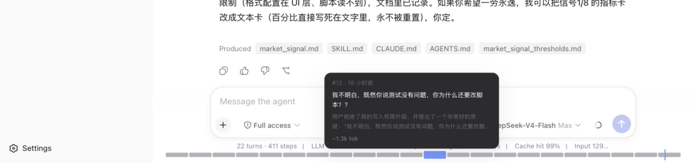
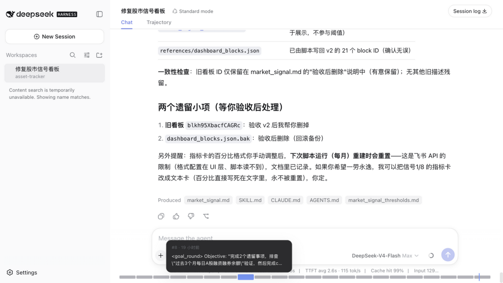

# dsh-turnbar

> 给你的 agent 会话装上视频进度条。

长会话很强大——直到你需要找回"80 轮之前提过的那条要求"。原生滚动条只能靠猜。
dsh-turnbar 给 DeepSeek Harness 的对话加上一条视频风格的进度条：悬停预览任意一轮、
拖动扫过、点击直达、`Esc` 返回原位。



**安装**（dsh ≥ 0.1.0-rc.5）：

```sh
dsh plugin --profile web add dsh-turnbar
```

重启 web 应用，打开任意会话，进度条就出现在输入框上方。零配置。历史会话自动回填，
进度条永远显示**完整**会话，而不是只显示已加载的部分。



## 功能

- 🎚 **全景进度条**：每轮一段，playhead 实时指示你读到哪一轮；超过 150 轮自动聚合
  为 ≤40 组，条永远不会糊成一片。
- 🖼 **悬停预览卡**：跳之前先看到"这轮讲了什么"——首句、工具调用数、文件改动、
  token 用量、轮内补充消息，一次悬停全到手。
- ⤴ **点击 / 拖动跳转**：点击 ≤300ms 落地并高亮；按住拖动像拖视频一样扫过各轮。
  目标轮不在已加载窗口时自动翻页加载。
- ↩ **Esc 返回原位**：跳转后按 `Esc`（或点 toast）精确回到跳转前的位置。
- 🧩 **优雅降级**：dsh 版本变动导致 API 不兼容时，插件自行隐藏，绝不破坏你的会话。

## 对比

| | dsh-turnbar | dsh-navbar | dsh-conversation-outline |
|---|---|---|---|
| 形态 | 常驻全景条 | 滑动窗口点链（>11 节点） | 侧栏大纲 tab |
| 数据来源 | 会话事件日志（全量历史） | 仅已加载 DOM | 会话日志（host） |
| 富元信息悬停预览 | ✅ 工具/文件/token | 仅文本 | 列表，无预览卡 |
| 拖动 scrub | ✅ | ❌ | ❌ |
| Esc 返回 | ✅ | ❌ | ❌ |
| 超出已加载窗口可用 | ✅ | ❌ | ❌ |
| 独立安装 | ✅ | ✅ | 依赖 better-sidebar |

三个插件都是 MIT 且各有所长——dsh-turnbar 在"手感"上走得更远：它是播放器，不是列表。

## 兼容性

已在 dsh `0.1.0-rc.5` / `0.1.0-rc.6`（web profile）实测。走官方
`conversation.composer.dock` 插槽，无 patch、无 UI hack。

## Roadmap

- v0.2：键盘导航（`⌘↑`/`⌘↓`）、书签
- v1.0：章节自动分段（任务边界）、`⌘K` 会话内搜索、token/上下文余量仪表

## 开发

```sh
pnpm install
pnpm test        # vitest：fold 逻辑、卡片模型、host 半区降级
pnpm build       # tsdown：lib/index.mjs（node 半区）+ lib/client.js（web 半区）
```

架构：双半区插件——node 半区把 `session/event` firehose 折叠为轮次记录（sidecar 持久化），
经 `/plugins/dsh-turnbar/state` 提供；web 半区把进度条渲染进官方 composer dock 插槽。
所有 dsh API 接触面收敛在 `src/platform/dsh/`。

## License

MIT，与 dsh 一致。 [English](README.md)
